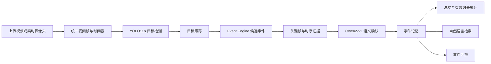

# 视界先知——VisionOracle

VisionOracle 是一套面向学习场景的本地视频事件理解与检索系统。系统支持上传视频和实时摄像头两种输入方式，通过 YOLO11n、目标跟踪、规则事件引擎和 Qwen2-VL-2B-Instruct，把连续视频转化为可回放、可总结、可自然语言检索的结构化事件时间线。

项目默认在本地完成视频读取、关键帧提取、目标检测、事件判断、录像归档和检索，不需要把用户视频上传到第三方推理服务。首次运行时如未指定本地 Qwen 模型目录，程序会通过 ModelScope 下载模型文件。

## 1. 核心能力

- 支持本地视频上传与电脑摄像头实时分析。
- 页面打开后自动预热 YOLO 和 Qwen 模型，模型就绪后才能开始分析。
- 识别并记录八类正式事件：坐到学习位置、离开学习位置、阅读、书写、使用手机、使用电脑、交流分心和其他行为。
- 生成全事件客观总结、事件时间线和按有效时长统计的扇形图。
- 支持“手机”“什么时候阅读了”等自然语言事件检索。
- 点击时间线或搜索结果可打开对应事件回放。
- 上传视频的事件回放尽量保留原视频音频。
- 摄像头分析从第一帧实际写入录像时开始计时；停止后生成从开始到停止的完整 MP4 回放。
- 超过 60 秒的单个事件使用开头、中间和结尾组成的摘要回放，并在弹窗中明确提示。
- 摄像头录像按实际采集帧率编码，保证录像时长与事件时间轴一致。

## 2. 系统流程



YOLO 只提供人物、桌椅、书本、手机、电脑、键盘和鼠标等物体线索，不直接把物体等同于行为。最终事件由跟踪结果、时间规则、关键帧和 Qwen2-VL 的结构化判断共同确认。

## 3. 项目目录

```text
AI-Video-Intelligence/
├── demo/
│   ├── app.py                 # Gradio Web 应用入口
│   └── core/                  # 页面事件名称、状态保存与日志工具
├── models/
│   └── yolo11n.pt             # YOLO11n 本地权重
├── src/
│   ├── detection/             # 视频源与 YOLO 检测
│   ├── event/                 # 事件协议、规则与状态机
│   ├── pipeline/              # 端到端流程、缓冲、录像与回放
│   ├── retrieval/             # 事件记忆与自然语言检索
│   ├── tracking/              # 目标跟踪
│   ├── vlm/                   # Qwen2-VL 加载、提示词与输出解析
│   └── main.py                # 命令行入口
├── .gitignore
└── README.md
```

`data/` 不随项目提交。应用首次运行后会按需自动创建关键帧、录像、回放、转码预览、运行报告和界面状态文件。

## 4. 运行环境

### 4.1 基本要求

- 操作系统：Windows 10/11（当前主要验证平台）；Linux 可运行文件分析流程，但摄像头设备编号和编解码环境需要自行确认。
- Python：推荐 3.11。
- 内存：建议 16 GB 或以上。
- 磁盘：建议至少预留 15 GB，用于 Python 环境、约 4.43 GB 的 Qwen 模型以及运行时视频数据。
- GPU：可使用 CPU，但 Qwen2-VL 推理会明显变慢；推荐具备至少 8 GB 显存的 NVIDIA GPU。
- 摄像头：仅实时摄像头模式需要，浏览器和 Windows 必须授予摄像头权限。

### 4.2 已验证环境

| 项目 | 已验证配置 |
|---|---|
| 操作系统 | Windows |
| Python | 3.11.15 |
| GPU | NVIDIA GeForce RTX 4060 Laptop GPU |
| PyTorch | 2.11.0 + CUDA 12.8 |
| Gradio | 6.26.0 |
| Ultralytics | 8.4.140 |
| Transformers | 5.16.1 |
| ModelScope | 1.39.1 |
| OpenCV | 5.0.0 |

这里记录的是当前项目通过运行验证的环境，不代表唯一可用版本。其他硬件平台应先验证 PyTorch、Ultralytics 和 Qwen2-VL 的兼容性。

## 5. 安装

以下命令均在项目根目录执行。

### 5.1 创建独立环境

```powershell
conda create -n visionoracle python=3.11 -y
conda activate visionoracle
python -m pip install --upgrade pip
```

也可以使用 Python 自带的虚拟环境：

```powershell
python -m venv .venv
.\.venv\Scripts\Activate.ps1
python -m pip install --upgrade pip
```

### 5.2 安装 PyTorch

当前已验证的 NVIDIA CUDA 12.8 配置：

```powershell
python -m pip install torch==2.11.0 torchvision==0.26.0 --index-url https://download.pytorch.org/whl/cu128
```

仅使用 CPU：

```powershell
python -m pip install torch==2.11.0 torchvision==0.26.0 --index-url https://download.pytorch.org/whl/cpu
```

如果本机 CUDA 环境不同，请使用 [PyTorch 官方安装选择器](https://pytorch.org/get-started/locally/) 生成匹配的安装命令，不要直接混用不同 CUDA 版本的 wheel。

### 5.3 安装项目依赖

```powershell
python -m pip install -r requirements.txt
```

检查 GPU 是否可用：

```powershell
python -c "import torch; print(torch.__version__); print(torch.cuda.is_available()); print(torch.cuda.get_device_name(0) if torch.cuda.is_available() else 'CPU')"
```

上面的检查只针对 NVIDIA CUDA。Intel 核显/独显运行 YOLO 时不使用 CUDA，按下一节安装 OpenVINO。

### 5.4 Intel GPU 的 YOLO 可选依赖

在 Intel AI PC 上执行：

```powershell
python -m pip install -r requirements-intel.txt
```

该文件包含普通项目依赖并额外安装 OpenVINO。未选择 `intel:*` 设备时，原有 CPU / NVIDIA CUDA 路径不受影响。

## 6. 模型准备

### 6.1 YOLO11n

项目检测器固定读取：

```text
models/yolo11n.pt
```

当前提交目录已包含该权重。如果文件缺失，可从 Ultralytics 官方资源下载：

```text
https://github.com/ultralytics/assets/releases/download/v8.3.0/yolo11n.pt
```

下载后必须保持文件名为 `yolo11n.pt` 并放入项目根目录的 `models/`。

Intel GPU 不能直接把 PyTorch `.pt` 权重当作 CUDA 模型运行。安装 Intel 依赖后，在学妹的 Intel AI PC 上执行一次导出和真实推理检查：

```powershell
python tools/intel/prepare_yolo_openvino.py --device intel:gpu --precision fp16
```

脚本会生成本机文件 `models/yolo11n_openvino_model/`，检查 OpenVINO 是否确实识别到 `GPU`，并在该 GPU 上完成一次 YOLO 推理。只有看到 `PASS: inference completed on the requested Intel device` 才能把本次 YOLO 设备记为 Intel GPU；否则应更新 Intel 显卡驱动或暂时使用 CPU，不得把回退结果写成 GPU 测试。

### 6.2 Qwen2-VL-2B-Instruct

推荐提前下载到独立模型目录，避免每次换环境时重新定位模型：

```powershell
python -c "from modelscope import snapshot_download; print(snapshot_download('Qwen/Qwen2-VL-2B-Instruct', local_dir=r'D:\AIModels\Qwen2-VL-2B-Instruct'))"
```

在当前 PowerShell 会话设置路径：

```powershell
$env:QWEN_VL_MODEL_PATH = "D:\AIModels\Qwen2-VL-2B-Instruct"
```

如不设置 `QWEN_VL_MODEL_PATH`，页面首次打开时程序会通过 ModelScope 自动下载或定位 `Qwen/Qwen2-VL-2B-Instruct`。首次下载需要稳定的网络连接，模型页面显示的文件规模约为 4.43 GB。

### 6.3 模型来源与许可证

| 模型 | 项目用途 | 官方来源 | 许可证说明 |
|---|---|---|---|
| Qwen2-VL-2B-Instruct | 关键帧语义理解、事件确认与客观描述 | [ModelScope 模型页](https://www.modelscope.cn/models/Qwen/Qwen2-VL-2B-Instruct/summary)、[Qwen 官方仓库](https://github.com/QwenLM/Qwen2-VL) | 模型页标注 Apache-2.0，使用和再分发前仍应核对模型卡及许可证原文 |
| Ultralytics YOLO11n | 人物及场景物体检测 | [Ultralytics 模型文档](https://docs.ultralytics.com/models/)、[官方权重资源](https://github.com/ultralytics/assets/) | Ultralytics 提供 AGPL-3.0 与 Enterprise 两种许可路径；公开、商业或闭源使用前必须按实际用途核对条款 |


## 7. 启动 Web 应用

Windows 推荐直接使用项目根目录中的启动脚本：

```powershell
.\run.ps1 -QwenModelPath "D:\AIModels\Qwen2-VL-2B-Instruct" -YoloDevice 0
```

首次安装依赖时可以执行：

```powershell
.\run.ps1 -InstallDependencies -QwenModelPath "D:\AIModels\Qwen2-VL-2B-Instruct" -YoloDevice 0
```

仅检查 Python、依赖、模型路径和权重文件而不启动页面：

```powershell
.\run.ps1 -CheckOnly
```

不传 `QwenModelPath` 时，脚本会沿用环境变量 `QWEN_VL_MODEL_PATH`；两者都未设置时，应用将通过 ModelScope 下载或读取缓存。需要手动启动时，可继续使用下面的命令。

### 7.1 推荐配置

```powershell
$env:QWEN_VL_MODEL_PATH = "D:\AIModels\Qwen2-VL-2B-Instruct"
$env:YOLO_DEVICE = "0"
$env:YOLO_CONFIDENCE = "0.35"
python demo/app.py
```

CPU 模式：

```powershell
$env:QWEN_VL_MODEL_PATH = "D:\AIModels\Qwen2-VL-2B-Instruct"
$env:YOLO_DEVICE = "cpu"
python demo/app.py
```

Intel GPU 模式（须先完成 6.1 节的导出和检查）：

```powershell
$env:QWEN_VL_MODEL_PATH = "D:\AIModels\Qwen2-VL-2B-Instruct"
.\run.ps1 -YoloDevice intel:gpu
```

首次安装 Intel 依赖也可通过启动脚本执行：

```powershell
.\run.ps1 -InstallDependencies -QwenModelPath "D:\AIModels\Qwen2-VL-2B-Instruct" -YoloDevice intel:gpu
```

依赖安装完成后仍须按 6.1 节导出一次 OpenVINO 模型；如果尚未导出，启动脚本会明确提示运行 `tools/intel/prepare_yolo_openvino.py`。

启动成功后访问：

```text
http://127.0.0.1:7860
```

### 7.2 环境变量

| 变量 | 默认值 | 作用 |
|---|---|---|
| `QWEN_VL_MODEL_PATH` | 未设置 | Qwen2-VL 本地模型目录；未设置时使用 ModelScope 下载/缓存 |
| `YOLO_DEVICE` | `0` | YOLO 推理设备；`cpu` 为 CPU，`0` / `cuda:0` 为 NVIDIA CUDA，`intel:gpu` 为 Intel GPU OpenVINO |
| `YOLO_OPENVINO_MODEL_PATH` | `models/yolo11n_openvino_model` | 可选的 OpenVINO YOLO IR 模型目录 |
| `YOLO_CONFIDENCE` | `0.35` | Web 应用中的 YOLO 最低置信度 |

### 7.3 页面启动状态

页面打开后会立即预热 YOLO 和 Qwen 模型：

1. 显示“正在加载模型（尚未录制）”时，开始按钮不可用。
2. 显示“模型已就绪”后，才可以开始上传视频或摄像头分析。
3. 模型在当前 Python 进程内缓存，后续两种输入方式复用同一份权重，不重复加载。

## 8. 使用方法

### 8.1 上传视频

1. 保持在“上传视频”页签。
2. 选择本地视频并等待播放器显示画面。
3. 点击“开始分析”。
4. 分析过程中不能切换输入方式，也不能恢复旧结果。
5. 分析完成后可查看全事件总结、有效总时长扇形图和事件时间线。
6. 输入“手机”“什么时候阅读了”等内容进行自然语言搜索。
7. 点击时间线或搜索结果查看事件回放。

上传视频使用原文件 FPS 构建稳定时间轴；事件回放从原视频按时间范围导出，并在条件允许时保留源音频。

### 8.2 实时摄像头

1. 切换到“实时摄像头”并允许浏览器访问摄像头。
2. 确认预览画面正常后点击“开始分析”。
3. “正在启动摄像头（尚未录制）”表示浏览器预览正在交接给后台采集。
4. 状态变为“正在录制并分析”时，第一帧已经写入录像，事件时间轴从此刻开始。
5. 点击“停止”后，系统立即停止采集并合并本轮录像；剩余事件语义分析可能继续一段时间。
6. 完整分析结束后可再次切换输入方式。

实时摄像头当前只采集视频，不采集麦克风音频。

## 9. 命令行运行

分析本地视频：

```powershell
python -m src.main --source "D:\Videos\sample.mp4" --qwen-model-path "D:\AIModels\Qwen2-VL-2B-Instruct" --yolo-device 0
```

使用第一个摄像头：

```powershell
python -m src.main --source 0 --qwen-model-path "D:\AIModels\Qwen2-VL-2B-Instruct" --yolo-device 0
```

只检查 YOLO、跟踪和 Event Engine，不加载 Qwen：

```powershell
python -m src.main --source "D:\Videos\sample.mp4" --no-vlm
```

输出详细链路日志：

```powershell
python -m src.main --source "D:\Videos\sample.mp4" --qwen-model-path "D:\AIModels\Qwen2-VL-2B-Instruct" --yolo-device 0 --trace
```

常用参数：

| 参数 | 默认值 | 说明 |
|---|---|---|
| `--source` | 必填 | 视频路径或摄像头编号 `0` |
| `--qwen-model-path` | 未设置 | 本地 Qwen 模型目录 |
| `--yolo-device` | `0` | YOLO 推理设备；Intel GPU 使用 `intel:gpu` |
| `--yolo-confidence` | `0.5` | 命令行模式下的检测阈值 |
| `--analysis-fps` | `2.0` | 每秒送入分析链路的目标帧数 |
| `--buffer-fps` | `2.0` | 关键帧缓冲采样率 |
| `--buffer-duration` | `30.0` | 内存关键帧缓冲时长 |
| `--recording-segment-seconds` | `60.0` | 摄像头录像分段时长 |
| `--replay-max-seconds` | `60.0` | 单次完整事件回放的最长时长 |
| `--max-frames` | 不限制 | 最多处理帧数 |
| `--max-duration` | 不限制 | 摄像头最大运行秒数 |
| `--query` | `刚才发生了什么？` | 运行完成后的检索问题 |
| `--trace` | 关闭 | 输出完整处理链路日志 |
| `--no-vlm` | 关闭 | 不加载 Qwen，仅运行前半链路 |

### 9.1 Intel AI PC 简化性能测试

完成 Intel GPU 导出检查后，用同一环境对指定测试视频运行一次完整 Pipeline：

```powershell
python tools/performance/run_intel_benchmark.py --source "D:\Videos\test_15s.mp4" --qwen-model-path "D:\AIModels\Qwen2-VL-2B-Instruct" --yolo-device intel:gpu --label intel_ai_pc
```

结果写入 `docs/performance/intel_ai_pc_时间/`。`environment.json` 和性能结果会分别记录 YOLO 的请求设备、实际设备、OpenVINO 后端、导出精度及 OpenVINO 可用设备，便于证明 YOLO 确实在 Intel GPU 上运行。这里的 `intel:gpu` 只决定 YOLO；Qwen 的实际设备仍由 PyTorch / Transformers 检测，并会单独记录，二者不能混写。

## 10. 运行时数据

以下内容由程序自动生成，已在 `.gitignore` 中排除：

| 路径 | 内容 |
|---|---|
| `data/clips/` | 事件关键帧与实时证据帧 |
| `data/previews/` | 为浏览器兼容性生成的上传视频预览 |
| `data/recordings/` | 摄像头录像分段 |
| `data/replays/` | 事件回放与完整摄像头录像 |
| `data/outputs/` | 命令行运行生成的 JSON 报告 |
| `data/ui_state.json` | 最近一次页面分析状态 |
| `result.txt` | Web 应用终端日志副本 |

这些文件可能包含个人画面或敏感行为信息。演示结束后应按实际隐私要求及时删除，不要提交到代码仓库。

## 11. 事件与回放规则

- 正式事件只有八类，不把“学习开始/结束”等内部状态写入页面时间线。
- 目标检测结果只作为弱证据；例如检测到手机不等于已经确认“使用手机”。
- VLM 或关键帧处理失败的候选进入拒绝记录，不作为已确认事件展示。
- 页面只合并同一视频、同一事件类型且真正相邻的事件窗口。
- 扇形图只统计时间线中已确认事件的有效时长，并按占比从大到小排列。
- 不在已确认事件范围内的时间不会伪造为“未分类事件”。
- 单个事件不超过 60 秒时导出完整回放；超过 60 秒时导出开头、中间、结尾摘要。
- 摄像头录像按实际帧数和采集时间计算输出 FPS，不通过重复补帧制造虚假时长。

## 12. 常见问题

### 页面一直显示“正在加载模型”

首次加载 Qwen 需要下载或读取约 4.43 GB 权重。优先确认磁盘空间、网络连接和 `QWEN_VL_MODEL_PATH` 是否指向包含完整模型文件的目录。

### ModelScope 出现 SSL 证书错误

如果出现 `CERTIFICATE_VERIFY_FAILED` 或 `EE certificate key too weak`，通常是网络代理、证书链或系统加密策略导致。不要在代码中关闭 SSL 校验。建议在网络正常的环境提前下载模型，再通过 `QWEN_VL_MODEL_PATH` 使用本地目录；必要时检查系统时间、代理证书和 Python/OpenSSL 环境。

### 找不到 `models/yolo11n.pt`

按“模型准备”章节下载官方权重，并确认路径严格为：

```text
项目根目录\models\yolo11n.pt
```

### 摄像头无法打开

- 在 Windows 设置中允许浏览器和桌面应用访问摄像头。
- 关闭会议软件、相机应用等可能独占摄像头的程序。
- 使用 `http://127.0.0.1:7860` 访问，不要通过不受信任的远程地址请求摄像头权限。
- 摄像头开始分析时会发生一次浏览器预览到 OpenCV 后台采集的交接，这是正常流程。

### GPU 显存不足

- 关闭其他占用显存的程序。
- 降低同时运行的模型或任务数量。
- 将 `YOLO_DEVICE` 设置为 `cpu` 只能把 YOLO 移到 CPU；Qwen 的 `device_map="auto"` 仍由 Transformers 根据当前 PyTorch 环境自动分配。
- 如需全 CPU 运行，建议安装 CPU 版 PyTorch，但推理速度会明显下降。

## 13. 隐私与使用边界

- 仅在获得被拍摄者授权的情况下采集和分析视频。
- 不要将本系统用于隐蔽监控、身份识别、高风险自动决策或未经同意的行为评价。
- 页面总结和事件判断属于模型输出，应保留人工复核环节。
- 对外展示前应清除 `data/`、日志和模型缓存中的个人数据。
